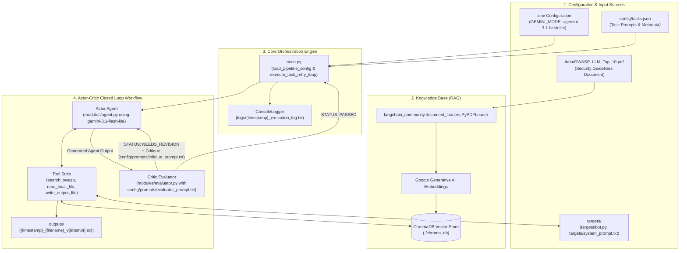

## 1. Tools (modules/tools.py)

The tools act as the Agent's interface to external systems, enabling it to query knowledge bases, inspect raw files, and save modified output artifacts.

- search_owasp_security_rules(query):
  - Role: RAG retrieval tool.
  - Function: Queries ChromaDB vector embeddings for security guidelines, OWASP risk codes (e.g., LLM01: Prompt Injection, LLM02: Insecure Output Handling), and remediation strategies stored from OWASP_LLM_Top_10.pdf.

- read_local_file(file_path):
  - Role: File inspection tool.
  - Function: Reads raw source code or configuration text directly from the filesystem (e.g., targets/bot.py, targets/system_prompt.txt) so the agent can audit its contents.

- write_output_file(content, filename):
  - Role: Artifact generation tool.
  - Function: Writes the refactored code fixes or markdown audit reports into the outputs/ folder. It automatically prefixes the session timestamp and appends the attempt version tag (e.g., {timestamp}_{filename}_v{attempt}.{ext}).

## 2. Prompts (config/prompts/)

The prompt suite governs the behavioral persona, evaluation criteria, and self-correction loops. All prompts are externalized into dedicated text files to separate prompt engineering from Python code.

- config/prompts/security_auditor.txt (Actor Persona):
  - Role: Instructs the primary LangChain agent (gemini-3.1-flash-lite).
  - Function: Defines the system identity as an expert AI Application Security Auditor, dictating how to analyze targets, invoke tools, and structure findings.

- config/prompts/evaluator_prompt.txt (Critic Rubric):
  - Role: Evaluator template loaded in modules/evaluator.py.
  - Function: Establishes the reflection evaluation rubric across three criteria:
    - Vulnerability Accuracy: Did the agent correctly identify OWASP codes?
    - Remediation Quality: Are proposed fixes secure and production-ready?
    - Action Completion: Were target files inspected and output files written?
      - Forces a strict decision format: STATUS: [PASSED or NEEDS_REVISION] and CRITIQUE: `<feedback>`.

- config/prompts/critique_prompt.txt (Feedback Loop Re-injection):
  - Role: Re-injection template loaded in main.py.
  - Function: Formats the evaluator's feedback from a failed pass and appends it back into conversation_messages as a follow-up human prompt for attempt N + 1.

## 3. Targets (targets/)

Targets represent the vulnerable or unverified application files under audit.

- targets/bot.py:
  - Type: Python source code.
  - Vulnerabilities Tested: LLM01 (Prompt Injection), LLM02 (Insecure Output Handling / unescaped execution).

- targets/system_prompt.txt:
  - Type: System prompt configuration text.
  - Vulnerabilities Tested: System Prompt Leakage, Sensitive Data Disclosure, unconstrained user instruction overrides.

- targets/agent_tools.py:
  - Type: Python source code (Tool Integrations).
  - Vulnerabilities Tested: LLM06 (Excessive Agency / Unsafe Tool Design), SSRF (Server-Side Request Forgery) from unvalidated LLM payloads, arbitrary code execution via custom tools.

- targets/api_router.py:
  - Type: Python source code (API Gateway / Router).
  - Vulnerabilities Tested: LLM07 (System Prompt Leakage / Insecure API Endpoints), Broken Access Control, unvalidated input routing to downstream LLM components.

## 4. Output for the Targets (outputs/)

Outputs are the versioned deliverables generated by the agent's write_output_file tool.

- Session & Version Synchronization:
  - Every generated file shares the exact execution timestamp of its parent main.py session and carries a version tag reflecting the attempt iteration (_v1, _v2, etc.).

- Generated File Types:
  - Refactored Code Fixes:
    - outputs/20260928_100000_bot_fixed_v1.py (Secure Python implementation resolving identified OWASP risks).
    - outputs/20260928_100000_agent_tools_fixed_v1.py (Hardened tool integrations with SSRF prevention and input validation).
    - outputs/20260928_100000_api_router_fixed_v1.py (Secured API router with rate-limiting, access controls, and sanitized payloads).
  - Security Audit Reports: outputs/20260928_100000_prompt_audit_v1.md (Markdown vulnerability breakdown and hardened system prompt recommendations).
