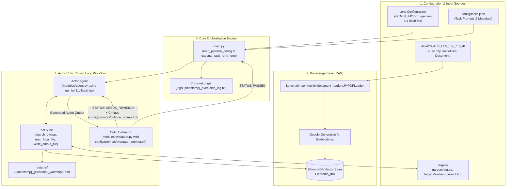

# Architecture

```mermaid
graph TD
    %% Environment & Configuration
    subgraph Config["1. Configuration & Input Sources"]
        ENV[".env Configuration\n(GEMINI_MODEL=gemini-3.1-flash-lite)"]
        TASKS["config/tasks.json\n(Task Prompts & Metadata)"]
        PDF["data/OWASP_LLM_Top_10.pdf\n(Security Guidelines Document)"]
        TARGETS["targets/\n(targets/bot.py, targets/system_prompt.txt)"]
    end

    %% Storage & Document Parsing
    subgraph Storage["2. Knowledge Base (RAG)"]
        LOADER["langchain_community.document_loaders.PyPDFLoader"]
        CHROMA[("ChromaDB Vector Store\n(./chroma_db)")]
        EMBED["Google Generative AI Embeddings"]
    end

    %% Core Pipeline Execution
    subgraph Engine["3. Core Orchestration Engine"]
        MAIN["main.py\n(load_pipeline_config & execute_task_retry_loop)"]
        LOGS["ConsoleLogger\n(logs/{timestamp}_execution_log.txt)"]
    end

    %% Actor-Critic Workflow Loop
    subgraph AgenticLoop["4. Actor-Critic Closed Loop Workflow"]
        ACTOR["Actor Agent\n(modules/agent.py using gemini-3.1-flash-lite)"]
        TOOLS["Tool Suite\n(search_owasp, read_local_file, write_output_file)"]
        CRITIC["Critic Evaluator\n(modules/evaluator.py with config/prompts/evaluator_prompt.txt)"]
        OUTPUTS["outputs/\n({timestamp}_{filename}_v{attempt}.ext)"]
    end

    %% Workflow Connections
    ENV --> MAIN
    TASKS --> MAIN
    PDF --> LOADER
    LOADER --> EMBED --> CHROMA

    MAIN --> LOGS
    MAIN --> ACTOR

    ACTOR <--> TOOLS
    TOOLS <--> CHROMA
    TOOLS <--> TARGETS
    TOOLS --> OUTPUTS

    ACTOR -- "Generated Agent Output" --> CRITIC
    CRITIC -- "STATUS: NEEDS_REVISION\n+ Critique (config/prompts/critique_prompt.txt)" --> ACTOR
    CRITIC -- "STATUS: PASSED" --> MAIN
```
